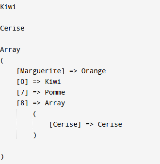
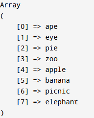
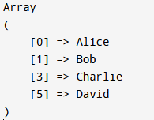
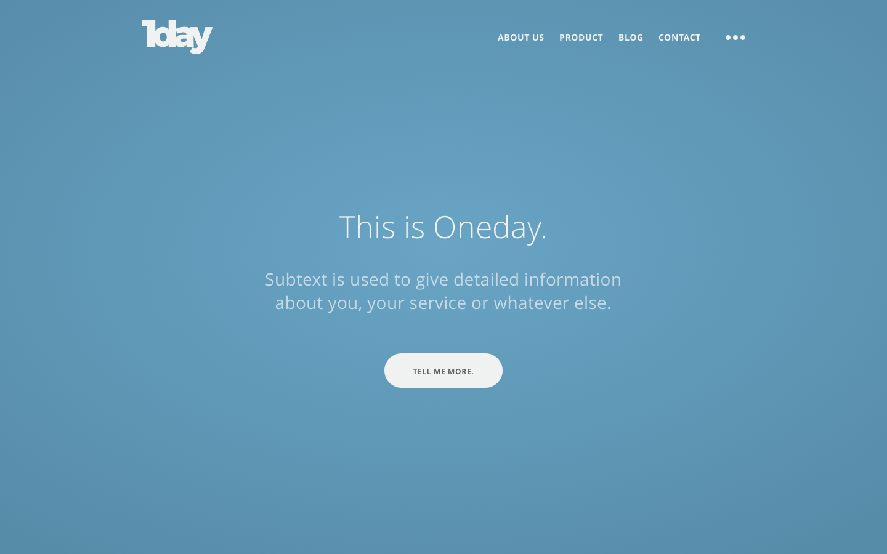

# Rendu - Test Technique - Edreams Factory

Ce dépôt contient les 3 exercices PHP demandés et un site web créée en HTML/CSS/JS. 
# Exercices PHP 

## Exercice 1

<table>
  <tr>
    <td>
      
    </td>
    <td style="vertical-align: top;">
      

        • Pour afficher "Kiwi", j'ai fais un <code>echo $messyArray[0]</code>. Kiwi étant le premier du tableau. 
        • Pour afficher "Cerise", j'ai refais un <code>echo $messyArray[8]["Cerise"]</code>. "Cerise" se trouve au 8ème indice car la clé de l'indice précédent à été défini à 7. 
        • Pour supprimer "Prune", j'ai utilisé <code>unset($messyArray[8][0])</code>. <code>unset()</code> détruit une variable. 
        • Pour afficher le tableau, j'ai utilisé un <code>print_r($messyArray)</code>. 
      

    </td>
  </tr>
</table>

## Exercice 2

<table>
  <tr>
    <td>
      
    </td>
    <td style="vertical-align: top;">
      

        J'ai d'abord réaliser la fonction permettant de trier et comparer s'il faut la longueur des mots : 
      

<pre>
<code>
function compare_words($a, $b) {
    $lenA = strlen($a);
    $lenB = strlen($b);
    if ($lenA == $lenB) {
        return strcmp($a, $b);
    }
    return $lenA - $lenB;
}
</code>
</pre>
      

• J'ai ensuite utilisé la fonction <code>usort()</code> qui permet de trier un tableau par rapport à une fonction, ici <code>compare_words</code>. 

• Pour afficher le tableau, j'ai utilisé un <code>print_r($random_words)</code>. 
      

    </td>
  </tr>
</table>

## Exercice 3

J'ai créé une classe ayant comme méthodes une fonction enlevant les Doublons : 

<table>
  <tr>
    <td>
      
    </td>
    <td style="vertical-align: top;">
<pre>
<code>
class Calcul {
    public function removeDoublon($prenomArray) {
        // Utiliser array_unique pour supprimer les doublons
        $resultArray = array_unique($prenomArray);
        // Retourner le tableau sans doublons
        return $resultArray;
    }
}
</code>
</pre>
    </td>
  </tr>
</table>

• Pour tester, on peut d'abord créer un instance : <code>$calcul = new Calcul();</code>.  
• Puis initialiser le tableau : <code>$prenomArray = ["Alice", "Bob", "Alice", "Charlie", "Charlie", "David"];</code> 
• Utiliser la méthode que l'on viens de créer pour notre class : <code>$resultArray = $calcul->removeDoublon($prenomArray);</code>.  
• Ensuite on affiche le résultat : <code>print_r($resultArray);</code>. 

# *Site Web *

Pour accéder au site, [SiteTest](https://raanki.github.io/Edreams-Factory-Test/Site_HTML_CSS_JS/index.html) 

- Présente des fonctionnalités telles qu'un menu hamburger, une fenêtre modale et un contenu principal centré. 
- Une fenêtre modale s'affiche avec un message de remerciement et un bouton de fermeture. 
- Dans sa version responsive, le site s'adapte aux appareils mobiles en modifiant la disposition des éléments. 

Le site devait ressembler à cette image :

  

